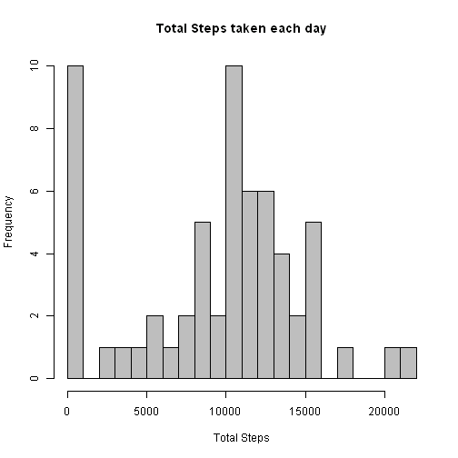
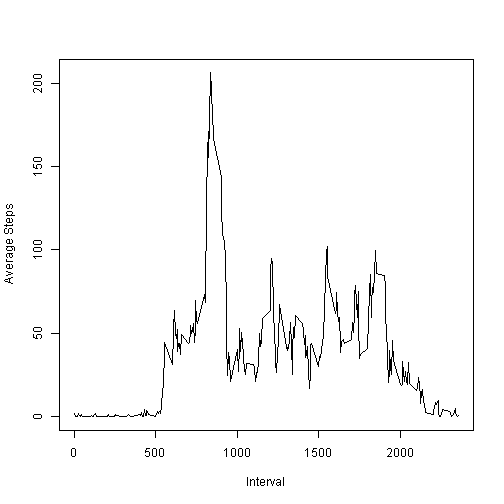
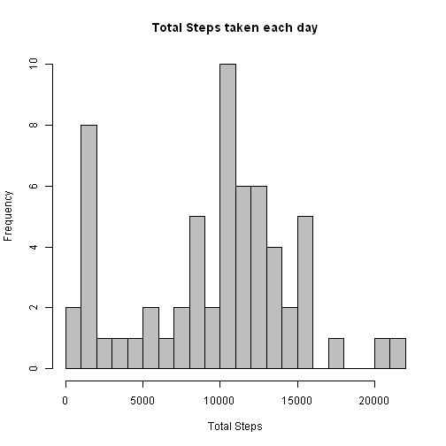
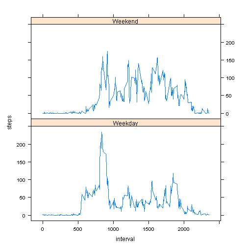

     
## Loading and preprocessing the data

1. Load the data
2. Process / transform the data  

```r
FitData <- read.csv("./activity.csv")
FitSum  <- aggregate(FitData$steps, by=list(FitData$date), na.rm=TRUE, FUN=sum)
# use na.rm=TRUE to remove NA values for the first part of the analysis
```

## What is mean total number of steps taken per day?

1. Make a histogram of the total number of steps taken each day
2. Calculate and report the *mean* and *median*

```r
hist(FitSum$x, breaks=25, main="Total Steps taken each day", xlab="Total Steps", col="grey")
```

 

```r
FitMean   <- mean(FitSum$x)
FitMedian <- median(FitSum$x)
```
And the mean is 9354.2 and the median is 10395.0    


## What is the average daily activity pattern?

1. Make a time series plot
2. Which 5-minute interval contains the maximum number of steps?

```r
FitDay <- aggregate(FitData$steps,by=list(FitData$interval),na.rm=TRUE, FUN=mean)
plot(FitDay$Group.1,FitDay$x, type="l", xlab="Interval", ylab="Average Steps")
```

 

```r
SumDay <- aggregate(FitData$steps,by=list(FitData$interval),na.rm=TRUE, FUN=sum)
SumMax <- SumDay[which.max(FitDay$x),1]
MaxSteps <- SumDay[which.max(FitDay$x),2]
```
The 5-minute interval with the biggest average across all the days is 835 with 10927 steps.

## Imputing missing values

1. Calculate and report the total number of missing values
2. Devise a strategy for filling in all of the missing values
3. Create a new dataset with the missing data filled in.
4. Make a histogram of the total number of steps taken each day
5. Calculate and report the mean and median total number of steps taken per day. 
6. Do these values differ from the estimates from the first part of the assignment? 
7. What is the impact of imputing missing data on the estimates of the total daily number of steps?


```r
FitNAs <- sum(is.na(FitData$steps))
FitData$newsteps <- ifelse(is.na(FitData$steps),as.integer(FitDay[FitData$interval,2]),FitData$steps)
FitSumx <- aggregate(FitData$newsteps,by=list(FitData$date),na.rm=TRUE, FUN=sum)
hist(FitSumx$x,breaks=25,main="Total Steps taken each day",xlab="Total Steps",col="grey")
```

 

```r
FitMeanx <- mean(FitSumx$x)
FitMedianx <- median(FitSumx$x)
```
The total number of NA observations is 2304  
I will replace using the average value of the number of steps taken 
on other days in that same interval (rounded down to an integer).    
The revised mean is 9543.5   ( from 9354.2 )
The revised median is 10395.0 ( from 10395.0 ) 

The mean values have increased by adding activity to replace the missing values. 
The total number of steps on any day can only increase by adding extra steps to replace missing activity.   
The median value has not changed as the days with most activity have not altered 
as they had few if any missing values.

## Are there differences in activity patterns between weekdays and weekends?
1. Create a new factor variable in the dataset with two levels -- "weekday" and "weekend" 
2. Make a panel plot containing a time series plot and the average number of steps taken, 
averaged across all weekday days or weekend days.  


```r
FitData$day <- ifelse(weekdays(as.Date(FitData$date)) == "Saturday", "Weekend", 
                      ifelse(weekdays(as.Date(FitData$date)) == "Sunday", "Weekend", "Weekday"))
FitData$day  <- factor(FitData$day)
FitWeeks = aggregate(steps ~ interval + day, FitData, mean)
library(lattice)
xyplot(steps ~ interval | factor(day), data = FitWeeks, aspect = 1/2, 
    type = "l")
```

 
   
There does appear to be differences between weekdays and weekends. 
On weekdays, there is a strong peak just after 0830, 
whereas at weekends, there is greater activity throughout the the daytime hours.  
